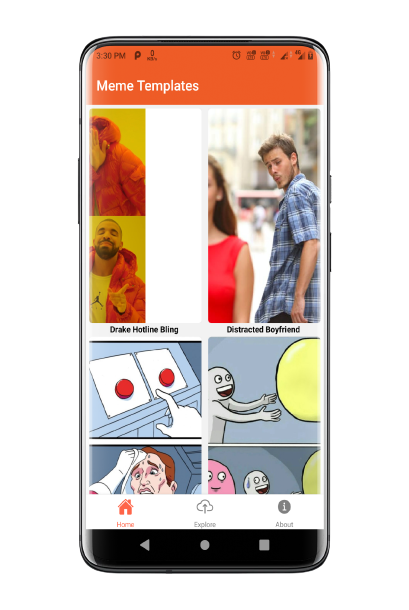
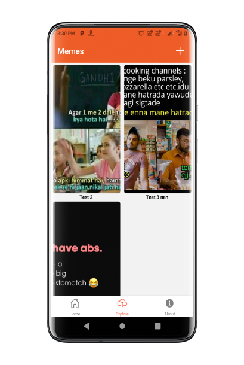
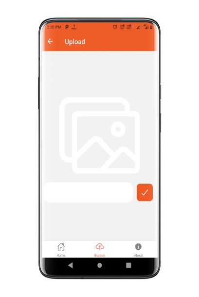
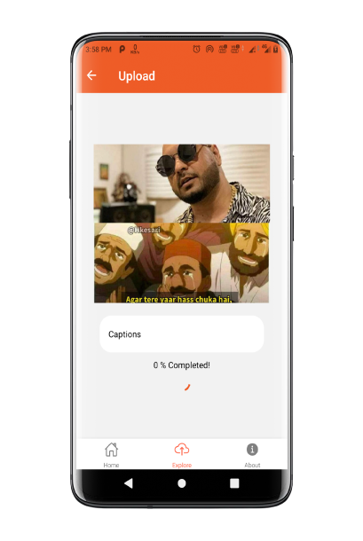
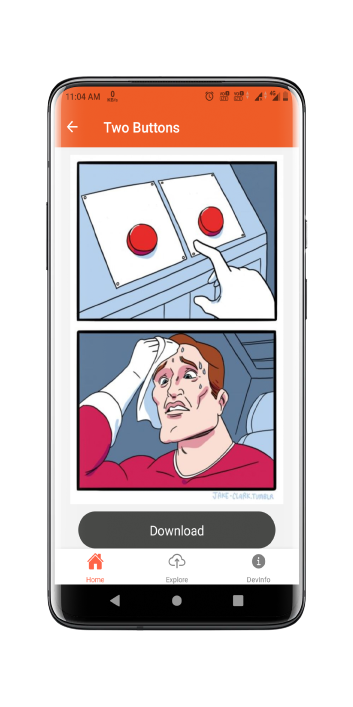

# MemeGenShare
An app where you can download popular meme templates, create a meme and upload it or enjoy meme uploaded by other

## Packages Used
- [React Navigation v5](https://reactnavigation.org/)
- [React Native Firebase v6](https://rnfirebase.io/)
- [React Native Vector Icons](https://github.com/oblador/react-native-vector-icons)
- [RN Fetch Blob](https://www.npmjs.com/package/rn-fetch-blob)
- [React Native Lottie Animation](https://www.npmjs.com/package/lottie-react-native)
- [React Native Image Picker](https://www.npmjs.com/package/react-native-image-picker)

## Meme Template api
- [Imageflip api](https://api.imgflip.com/)

### OnBoarding Animation

### Home/Templates

### View Uploaded/Upload

### Dowmload Templates/Meme

### Info

